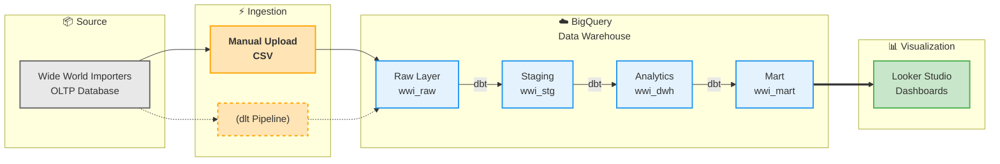

# Wide World Importers Data Warehouse
> A data warehouse project built from the **Wide World Importers** operational database, designed to consolidate business data into a dimensional model optimized for analytics and visualization.

[](https://www.getdbt.com/)
[](https://cloud.google.com/bigquery)
[](https://www.microsoft.com/sql-server)
[](https://lookerstudio.google.com/)
[](https://www.python.org/)

---

## 📊 Overview

This project consolidates **Wide World Importers** OLTP data into a **BigQuery** data warehouse using **dbt** for transformation and **Looker Studio** for visualization.

| Layer | Technology | Description |
|--------|-------------|-------------|
| **Source** | SQL Server | Wide World Importers OLTP database |
| **Ingestion** | Manual upload | Data ingestion pipeline to BigQuery. Plan to dlt |
| **Warehouse** | BigQuery | Cloud data warehouse (raw → staging → DWH → mart) |
| **Transformation** | dbt Core | Modular ELT transformations, dimensional modeling |
| **Visualization** | Looker Studio | Interactive dashboards & self-service BI |

**Business Problem:** Analytical queries slow down the transactional system; business teams rely on IT for ad-hoc reports.  
**Solution:** A scalable cloud data warehouse with star schema models and self-service BI.  
**Outcomes:** Faster insights, sub-5s dashboards, and reduced IT dependency.


*Figure: Dimensional model overview*

---

## 🏗️ Architecture

**Data Flow**



**Data Layers**

- `wwi_raw` - Raw data ingested from source
- `wwi_stg` - Staging and intermediate transformations
- `wwi_dwh` - Dimensional models (facts & dimensions)
- `wwi_mart` - Denormalized reporting datasets


---

## 📂 Project Structure

```
├── docs/                           # Project documentation
├── etl/                            # Data ingestion scripts
├── wide_world_importers_dw/        # dbt project
│   ├── models/
│   │   ├── staging/                # Source data standardization
│   │   ├── analytics/              # Dimensional models (dim_*, fact_*)
│   │   └── marts/                  # Denormalized reporting datasets
│   └── dbt_project.yml
└── scripts/                        # Utility SQL scripts
```

## 📈 Sample Reports

[View Live Dashboard](https://lookerstudio.google.com/reporting/54a88f82-aeee-494c-b81f-31bb320f299c)


## 📚 Documentation

- [Project Roadmap](docs/project_roadmap.md) - Business context, objectives, status, and future plans
- [Technical Design](docs/technical_design.md) - Architecture and technology stack
- [Data Modeling](docs/data_modelling.md) - Dimensional model design
- [Data Catalog](docs/data_warehouse_catalog.md) - Table and column definitions
- [Naming Conventions](docs/naming_convention.md) - Standards and best practices

## 🚀 Quick Start

**Requirements:** Python 3.9+, dbt-bigquery, GCP credentials

```bash
# Install dependencies
pip install -r requirements.txt

# Configure dbt
cp profiles.sample.yml ~/.dbt/profiles.yml

# Run models & tests
cd wide_world_importers_dw
dbt run
dbt test
