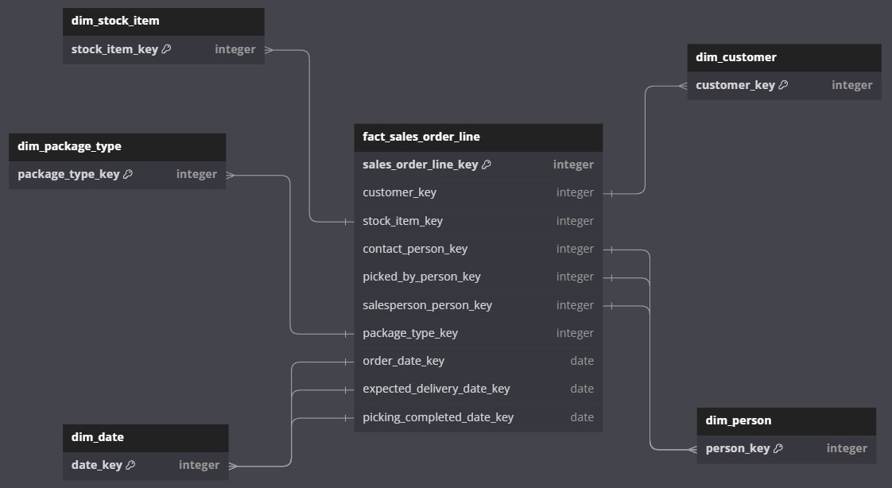

# pj-dw-wide-world-importers

### **BigQuery Structure**

**1. Project**

* `thupla-dw-dev`:  the development environment

**2. Datasets**

* **`wwi_raw`** : ✅ Stores raw data as ingested directly from the source
* **`wwi_stg`** : ✅ For staging and intermediate models.
  * Cleaned/standardized data tables.
  * Join and transform raw tables for analytics preparation.
* **`wwi_dwh`** : ✅ For finalized models (e.g., facts and dimensions)

### dbt models

dbt project /models:

```
/staging
---/wide_world_importers
stg_X.sql
/analytics
dim_X.sql
fact_X.sql
---/marts
    mart_
/intermediate
int_X.sql
/exposures
```

## Dimensional modelling

### Bus Matrix

### High-level design



### Mapping

## Notes

### Convention

#### SQL convention

1. Naming convention

   * **Tables** : `snake_case`, plural for fact tables, singular for dimension table
   * **Columns**
   * Indexes
   * Constraints
2. Query syntax

   * ✅ **Uppercase SQL keywords**
   * ✅ **Comma at the beginning of columns in SELECT**
   * ✅ **Consistent indentation**
   * Use schema names

   ```SQL
   SELECT
       customer_id
       , SUM(order_total) AS total_sales
   FROM fact_sales
   WHERE order_date >= '2024-01-01'
   GROUP BY customer_id
   ORDER BY total_sales DESC;
   ```

### Future enhancements

* Dynamically generate the column selection, renaming & type casting queries using a source-to-target mapping file
* Design for multiple data source
