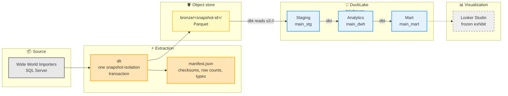

# Wide World Importers Data Warehouse

> Kimball star schema over the Wide World Importers sample OLTP, built on a DuckLake lakehouse.

[](https://www.getdbt.com/)
[](https://duckdb.org/)
[](https://parquet.apache.org/)
[](https://www.postgresql.org/)
[](https://www.microsoft.com/sql-server)
[](https://www.python.org/)

## Quick start

Needs `git`, `make`, [uv](https://docs.astral.sh/uv/) and a container runtime. No cloud account, no
SQL Server, nothing to fill in.

```bash
make demo
```

Installs the environment and dbt packages, writes a `.env` with generated local credentials, brings
up the object store and catalog, publishes the committed fixture, verifies every object against its
checksum, builds 23 models, runs 44 tests, prints every relation.

It refuses rather than guesses twice: if `MSSQL_CONNECTION_STRING` is set, and if the lake already
holds a warehouse this fixture did not build.

## Overview

| Layer | Technology | Role |
|---|---|---|
| Source | SQL Server | WWI OLTP, one read-only login |
| Extraction | dlt | 21 tables to Parquet in one snapshot-isolation transaction |
| Storage | S3-compatible object store | snapshot under `bronze/<id>/`, lake under `lake/` |
| Warehouse | DuckLake (DuckDB + Postgres catalog) | raw → staging → analytics → mart |
| Transformation | dbt Core | dimensional models, enforced contract on the mart |

**Problem:** analytical queries slow the transactional system; reports need IT.
**Solution:** a dimensional warehouse reproducible from a checksummed snapshot.


## Architecture

Two stages. The boundary is the point: **the extraction holds the source credential, nothing
downstream can reach the source.** Enforced — `make lint` fails if any package outside the source
connector acquires the means to connect.


```mermaid
flowchart LR
    subgraph source["📦 Source"]
        OLTP[Wide World Importers<br/>SQL Server]
    end

    subgraph ingest["⚡ Extraction"]
        direction TB
        DLT[dlt<br/>one snapshot-isolation<br/>transaction]
        MANIFEST[manifest.json<br/>checksums, row counts, types]
    end

    subgraph store["🪣 Object store"]
        BRONZE[bronze/&lt;snapshot-id&gt;/<br/>Parquet]
    end

    subgraph dwh["🦆 DuckLake<br>lakehouse"]
        direction TB
        STG[Staging<br/>main_stg]
        ANALYTICS[Analytics<br/>main_dwh]
        MART[Mart<br/>main_mart]

        STG -->|dbt| ANALYTICS
        ANALYTICS -->|dbt| MART
    end

    subgraph bi["📊 Visualization"]
        LOOKER[Looker Studio<br/>frozen exhibit]
    end

    OLTP --> DLT
    DLT --> MANIFEST
    DLT --> BRONZE
    BRONZE -->|dbt reads s3://| STG
    MART -.-> LOOKER

    style OLTP fill:#E8E8E8,stroke:#666,stroke-width:2px,color:#333
    style DLT fill:#FFE4B5,stroke:#FFA500,stroke-width:2px,color:#333
    style MANIFEST fill:#FFE4B5,stroke:#FFA500,stroke-width:2px,color:#333
    style BRONZE fill:#FFF9C4,stroke:#FBC02D,stroke-width:2px,color:#333
    style STG fill:#E3F2FD,stroke:#2196F3,stroke-width:2px,color:#333
    style ANALYTICS fill:#E3F2FD,stroke:#2196F3,stroke-width:2px,color:#333
    style MART fill:#E3F2FD,stroke:#2196F3,stroke-width:2px,color:#333
    style LOOKER fill:#EEEEEE,stroke:#9E9E9E,stroke-width:2px,stroke-dasharray: 5 5,color:#333
```

One catalog; the layers are schemas inside it.

| Schema | Holds |
|---|---|
| `bronze/<id>/` | Parquet on the object store, read in place |
| `main_stg` | staging (`stg_`) and intermediate (`int_`) |
| `main_dwh` | dimensions and facts (`dim_`, `fact_`) |
| `main_mart` | denormalized reporting tables (`mart_`) |

## Three ways to seed

| Command | Data | Use |
|---|---|---|
| `make demo` | committed fixture, ~2.4 MB, real rows and checksums | fresh clone; what CI builds |
| `make seed_bronze` | the real snapshot from `data/raw/` | the full warehouse |
| `make seed_bronze_empty` | zero-row Parquet with the manifest's schema | "did a column break", not "is the data right" |

**The Parquet snapshot is not in this repository and never will be** — only its manifest is. The
fixture in `data/demo/` is a reduced derivative with its own manifest and its own real checksums, so
a clone runs the same seed-and-verify path. Nothing downstream can tell them apart; `SNAPSHOT_ID`
selects between them.

## Commands

```bash
make check      # lint, import boundaries, types, unit tests, sources.yml drift
make build      # dbt build against whatever is seeded
make verify     # published snapshot against its manifest
make shape      # every relation with its row and column count
make compare    # build twice, diff every table
make extract    # refresh the snapshot from SQL Server
make down       # stop the stack, keeping data (clean_storage deletes it)
```

## Project structure

```
├── docs/                    # Project documentation
├── infrastructure/          # Container config, source login SQL
├── data/
│   ├── demo/                # Committed fixture
│   └── snapshots/           # manifest.json — the snapshot contract
├── src/
│   ├── cli/                 # The `wwi` command
│   ├── config/              # Settings; the only place an env var is named
│   ├── connectors/          # mssql, s3, ducklake
│   ├── contracts/           # Manifest, paths, types, dbt sources projection
│   ├── ingestion/           # Source → Parquet → object store
│   ├── warehouse/           # Reading the built warehouse
│   ├── demo/                # The fresh-clone path
│   └── utils/
├── tests/                   # unit/ needs nothing; integration/ needs the stack
├── wide_world_importers_dw/ # dbt project
└── docker-compose.yml       # Object store + DuckLake catalog
```

## Documentation

| Document | Covers |
|---|---|
| [Roadmap](docs/project_roadmap.md) | Business context, status, what comes next |
| [Technical Design](docs/technical_design.md) | Architecture and stack |
| [Data Modeling](docs/data_modelling.md) | Dimensional model |
| [Data Catalog](docs/data_warehouse_catalog.md) | Tables and columns |
| [Naming Conventions](docs/naming_convention.md) | Standards and SQL style |

## Sample reports — a frozen exhibit

**These dashboards run against a BigQuery build that is no longer maintained.** The warehouse moved
to DuckLake; the BigQuery datasets and the ingestion that fed them are kept as an exhibit, not as
something this repository can reproduce.

[View Live Dashboard](https://lookerstudio.google.com/reporting/54a88f82-aeee-494c-b81f-31bb320f299c)


