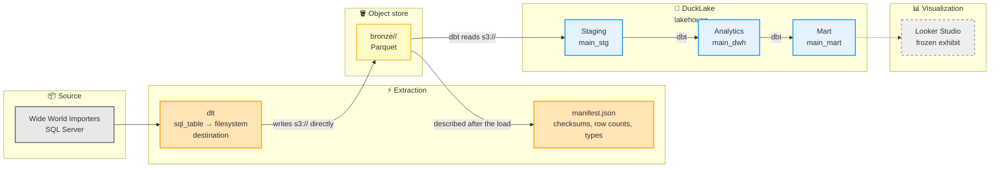

# Wide World Importers Data Warehouse

> Kimball star schema over the Wide World Importers sample OLTP, built on a DuckLake lakehouse.

[](https://www.getdbt.com/) [](https://duckdb.org/) [](https://parquet.apache.org/) [](https://www.postgresql.org/) [](https://www.microsoft.com/sql-server) [](https://www.python.org/)

## Quick start

**This repository ships no data.** The warehouse is built from a snapshot of a live source, so you need a SQL Server holding the [Wide World Importers](https://learn.microsoft.com/en-us/sql/samples/wide-world-importers-what-is) sample database, plus `git`, `make`, [uv](https://docs.astral.sh/uv/) and a container runtime.

```bash
# 1. Credentials. Fill in S3_ACCESS_KEY, S3_SECRET_KEY, CATALOG_USER, CATALOG_PASSWORD
#    and MSSQL_CONNECTION_STRING. Everything else already has a working default.
cp .env.example .env

# 2. A dbt profile where dbt looks for one. Every value in it comes from the environment.
mkdir -p ~/.dbt && cp profiles.sample.yml ~/.dbt/profiles.yml

# 3. Environment and dbt packages, then the object store and the DuckLake catalog.
make install deps up

# 4. Source → bronze on the store, then the manifest, sources.yml and a read-back check.
make extract

# 5. Build the models and run every test, then print every relation with its shape.
make build
make shape
```

The extraction needs a read-only login on the source; `infrastructure/mssql/prepare_extraction_login.sql` creates one. It grants `db_datareader` and nothing beyond it — no writes, no schema changes, no CDC.

## Overview

| Layer          | Technology                           | Role                                                       |
| -------------- | ------------------------------------ | ---------------------------------------------------------- |
| Source         | SQL Server                           | WWI OLTP, one read-only login                              |
| Extraction     | dlt                                  | declared tables straight to Parquet on the object store    |
| Storage        | S3-compatible object store           | snapshot under`bronze/<id>/`, lake under `lake/`       |
| Warehouse      | DuckLake (DuckDB + Postgres catalog) | raw → staging → analytics → mart                        |
| Transformation | dbt Core                             | dimensional models, enforced contract on the mart          |

**Problem:** analytical queries slow the transactional system; reports need IT. **Solution:** a dimensional warehouse reproducible from a checksummed snapshot.


## Architecture

Two stages. The boundary is the point: **the extraction holds the source credential, nothing downstream can reach the source.** Enforced — `make lint` fails if any package outside the source connector acquires the means to connect.


```mermaid
flowchart LR
    subgraph source["📦 Source"]
        OLTP[Wide World Importers<br/>SQL Server]
    end

    subgraph ingest["⚡ Extraction"]
        direction TB
        DLT[dlt<br/>sql_table → filesystem<br/>destination]
        MANIFEST[manifest.json<br/>checksums, row counts, types]
    end

    subgraph store["🪣 Object store"]
        BRONZE[bronze/<snapshot-id>/<br/>Parquet]
    end

    subgraph dwh["🦆 DuckLake<br>lakehouse"]
        direction TB
        STG[Staging<br/>main_stg]
        ANALYTICS[Analytics<br/>main_dwh]
        MART[Mart<br/>main_mart]

        STG -->|dbt| ANALYTICS
        ANALYTICS -->|dbt| MART
    end

    subgraph bi["📊 Visualization"]
        LOOKER[Looker Studio<br/>frozen exhibit]
    end

    OLTP --> DLT
    DLT -->|writes s3:// directly| BRONZE
    BRONZE -->|described after the load| MANIFEST
    BRONZE -->|dbt reads s3://| STG
    MART -.-> LOOKER

    style OLTP fill:#E8E8E8,stroke:#666,stroke-width:2px,color:#333
    style DLT fill:#FFE4B5,stroke:#FFA500,stroke-width:2px,color:#333
    style MANIFEST fill:#FFE4B5,stroke:#FFA500,stroke-width:2px,color:#333
    style BRONZE fill:#FFF9C4,stroke:#FBC02D,stroke-width:2px,color:#333
    style STG fill:#E3F2FD,stroke:#2196F3,stroke-width:2px,color:#333
    style ANALYTICS fill:#E3F2FD,stroke:#2196F3,stroke-width:2px,color:#333
    style MART fill:#E3F2FD,stroke:#2196F3,stroke-width:2px,color:#333
    style LOOKER fill:#EEEEEE,stroke:#9E9E9E,stroke-width:2px,stroke-dasharray: 5 5,color:#333
```

One catalog; the layers are schemas inside it.

| Schema           | Holds                                          |
| ---------------- | ---------------------------------------------- |
| `bronze/<id>/<table>/` | Parquet on the object store, read in place |
| `main_stg`     | staging (`stg_`) and intermediate (`int_`) |
| `main_dwh`     | dimensions and facts (`dim_`, `fact_`)     |
| `main_mart`    | denormalized reporting tables (`mart_`)      |

## Filling bronze

`make extract` is the only way, and it is one dlt run: every declared table read from the source and written straight to `s3://$S3_BUCKET/bronze/<snapshot-id>/<table>/`. Nothing is staged locally and there is no upload step. The manifest is then written from what actually landed, read back through the S3 API, so its checksums cover the published bytes.

**The Parquet snapshot is not in this repository and never will be** — only its manifest is. That manifest is the whole contract: SHA256, row count and column types per table, and `make verify` checks the store against it without touching the source.

A new extraction lands under a new snapshot id, beside the previous one rather than over it. `SNAPSHOT_ID` points a build at one; unset, `sources.yml` defaults to the id its manifest names.

## Commands

```bash
make check      # lint, import boundaries, types, unit tests, sources.yml drift
make build      # dbt build against whatever is in bronze
make verify     # published snapshot against its manifest
make shape      # every relation with its row and column count
make compare    # build twice, diff every table
make extract    # refresh the snapshot from SQL Server
make down       # stop the stack, keeping data (clean_storage deletes it)
```

## Project structure

```
├── docs/                    # Project documentation
├── infrastructure/          # Container config, source login SQL
├── data/
│   └── snapshots/           # manifest.json — the snapshot contract
├── src/
│   ├── cli/                 # The `wwi` command
│   ├── config/              # Settings; the only place an env var is named
│   ├── connectors/          # mssql, s3, ducklake
│   ├── contracts/           # Manifest, paths, types, dbt sources projection
│   ├── ingestion/           # Source → Parquet → object store
│   ├── warehouse/           # Reading the built warehouse
│   └── utils/
├── tests/                   # unit/ needs nothing; integration/ needs the stack
├── wide_world_importers_dw/ # dbt project
└── docker-compose.yml       # Object store + DuckLake catalog
```

## Documentation

| Document                                       | Covers                                    |
| ---------------------------------------------- | ----------------------------------------- |
| [Roadmap](docs/project_roadmap.md)              | Business context, status, what comes next |
| [Technical Design](docs/technical_design.md)    | Architecture and stack                    |
| [Data Modeling](docs/data_modelling.md)         | Dimensional model                         |
| [Data Catalog](docs/data_warehouse_catalog.md)  | Tables and columns                        |
| [Naming Conventions](docs/naming_convention.md) | Standards, SQL style, Markdown formatting |

## Sample reports — a frozen exhibit

**These dashboards run against a BigQuery build that is no longer maintained.** The warehouse moved to DuckLake; the BigQuery datasets and the ingestion that fed them are kept as an exhibit, not as something this repository can reproduce.

[View Live Dashboard](https://lookerstudio.google.com/reporting/54a88f82-aeee-494c-b81f-31bb320f299c)


