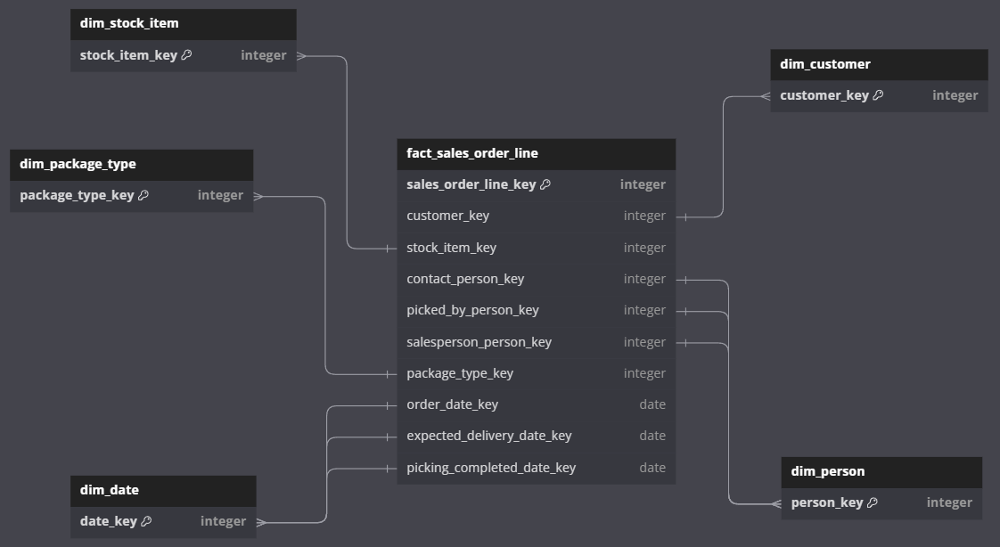
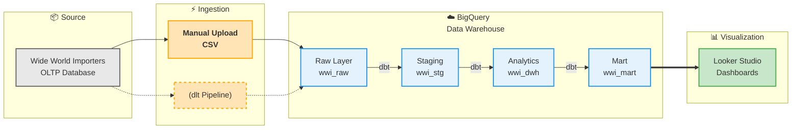
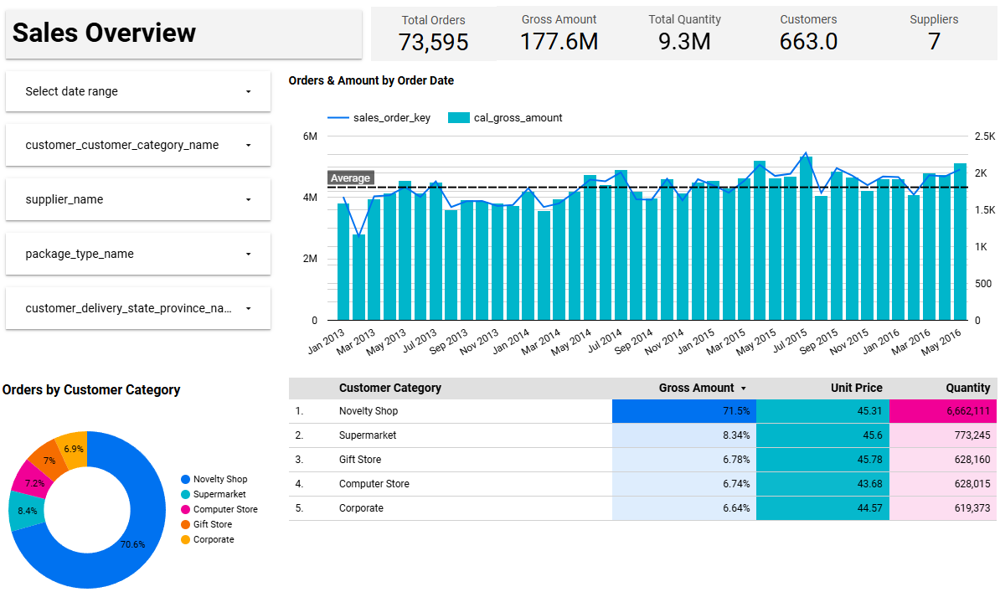

# Wide World Importers Data Warehouse
> A data warehouse project built from the **Wide World Importers** operational database, designed to consolidate business data into a dimensional model optimized for analytics and visualization.

[](https://www.getdbt.com/)
[](https://cloud.google.com/bigquery)
[](https://www.microsoft.com/sql-server)
[](https://lookerstudio.google.com/)
[](https://www.python.org/)

---

## 📊 Overview

This project consolidates **Wide World Importers** OLTP data into a **BigQuery** data warehouse using **dbt** for transformation and **Looker Studio** for visualization.

| Layer | Technology | Description |
|--------|-------------|-------------|
| **Source** | SQL Server | Wide World Importers OLTP database |
| **Ingestion** | Manual upload | Data ingestion pipeline to BigQuery. Plan to dlt |
| **Warehouse** | BigQuery | Cloud data warehouse (raw → staging → DWH → mart) |
| **Transformation** | dbt Core | Modular ELT transformations, dimensional modeling |
| **Visualization** | Looker Studio | Interactive dashboards & self-service BI |

**Business Problem:** Analytical queries slow down the transactional system; business teams rely on IT for ad-hoc reports.  
**Solution:** A scalable cloud data warehouse with star schema models and self-service BI.  
**Outcomes:** Faster insights, sub-5s dashboards, and reduced IT dependency.


*Figure: Dimensional model overview*

---

## 🏗️ Architecture

**Data Flow**


```mermaid
flowchart LR
    subgraph source["📦 Source"]
        OLTP[Wide World Importers<br/>OLTP Database]
    end
    
    subgraph ingest["⚡ Ingestion"]
        direction TB
        CSV[<b>Manual Upload<br/>CSV</b>]
        DLT["(dlt Pipeline)"]
    end
    
    subgraph dwh["☁️ BigQuery<br>Data Warehouse"]
        direction TB
        
        RAW[Raw Layer<br/>wwi_raw]
        STG[Staging<br/>wwi_stg]
        ANALYTICS[Analytics<br/>wwi_dwh]
        MART[Mart<br/>wwi_mart]
        
        RAW -->|dbt| STG
        STG -->|dbt| ANALYTICS
        ANALYTICS -->|dbt| MART
    end
    
    subgraph bi["📊 Visualization"]
        LOOKER[Looker Studio<br/>Dashboards]
    end
    
    OLTP --> CSV
    OLTP -.-> DLT
    CSV --> RAW
    DLT -.-> RAW
    MART ==> LOOKER
    
    style OLTP fill:#E8E8E8,stroke:#666,stroke-width:2px,color:#333
    style CSV fill:#FFE4B5,stroke:#FFA500,stroke-width:2px,color:#333
    style DLT fill:#FFE4B5,stroke:#FFA500,stroke-width:2px,stroke-dasharray: 5 5,color:#333
    style RAW fill:#E3F2FD,stroke:#2196F3,stroke-width:2px,color:#333
    style STG fill:#E3F2FD,stroke:#2196F3,stroke-width:2px,color:#333
    style ANALYTICS fill:#E3F2FD,stroke:#2196F3,stroke-width:2px,color:#333
    style MART fill:#E3F2FD,stroke:#2196F3,stroke-width:2px,color:#333
    style LOOKER fill:#C8E6C9,stroke:#4CAF50,stroke-width:2px,color:#333
```

**Data Layers**

- `wwi_raw` - Raw data ingested from source
- `wwi_stg` - Staging and intermediate transformations
- `wwi_dwh` - Dimensional models (facts & dimensions)
- `wwi_mart` - Denormalized reporting datasets


---

## 📂 Project Structure

```
├── docs/                           # Project documentation
├── etl/                            # Data ingestion scripts
├── wide_world_importers_dw/        # dbt project
│   ├── models/
│   │   ├── staging/                # Source data standardization
│   │   ├── analytics/              # Dimensional models (dim_*, fact_*)
│   │   └── marts/                  # Denormalized reporting datasets
│   └── dbt_project.yml
└── scripts/                        # Utility SQL scripts
```

## 📈 Sample Reports

[View Live Dashboard](https://lookerstudio.google.com/reporting/54a88f82-aeee-494c-b81f-31bb320f299c)



## 📚 Documentation

- [Project Roadmap](docs/project_roadmap.md) - Business context, objectives, status, and future plans
- [Technical Design](docs/technical_design.md) - Architecture and technology stack
- [Data Modeling](docs/data_modelling.md) - Dimensional model design
- [Data Catalog](docs/data_warehouse_catalog.md) - Table and column definitions
- [Naming Conventions](docs/naming_convention.md) - Standards and best practices

## 🚀 Quick Start

**Requirements:** `git`, `make`, [uv](https://docs.astral.sh/uv/) and a container runtime. That is
the whole list -- no cloud account, no SQL Server, and nothing to fill in by hand.

```bash
make demo
```

One command, and it does not shorten anything away: it installs the pinned environment and the dbt
packages, writes a `.env` with generated local credentials, brings up the object store and the
DuckLake catalog, publishes the committed fixture, **verifies every object against its checksum**,
builds all 23 models, runs all 44 tests, and prints every relation with its row count. Measured on a
fresh clone with no source database: **36 seconds cold, 31 seconds on a second run.**

It refuses rather than guesses in two places. If `MSSQL_CONNECTION_STRING` is set it stops -- the
transform half must never be able to reach the source. If the lake already holds a warehouse this
fixture did not build, it stops and names the row counts that told it so, rather than mixing fixture
rows into a real warehouse.

<details>
<summary>The same thing as separate steps</summary>

```bash
make install                # the pinned environment
make deps                   # the dbt packages -- dbt_packages/ is git-ignored, so this is not optional
cp .env.example .env        # then set the store and catalog credentials
cp profiles.sample.yml ~/.dbt/profiles.yml
make up                     # object store, DuckLake catalog, bucket
make seed_bronze_empty      # or `make seed_bronze` with a real snapshot in data/raw/
make build
```

</details>

**The Parquet snapshot is not in this repository and never will be** -- only the manifest that
describes it is. What a fresh clone does have is `data/demo/`: a reduced, labelled derivative of
that snapshot, ~2.4 MB, carrying every dimension whole and one window of facts. It has its own
manifest with its own real checksums, so a clone runs the same seed-and-verify path the shipped
snapshot does and the warehouse it builds returns numbers rather than empty relations.

Two artifacts, one contract. The snapshot is what the extraction produces and what the warehouse is
built from in earnest; the fixture is what makes the repository runnable by someone who has neither
SQL Server nor 24 MB of Parquet. Nothing downstream can tell them apart -- no model, test or macro
names either one, and `SNAPSHOT_ID` is the only thing that selects between them.

With the real snapshot in `data/raw/`, `make seed_bronze` publishes it to the store instead and the
build produces the warehouse in full: 23 models and 44 tests.

`make seed_bronze_empty` remains for the third case, and it is worth knowing what it is for: it
writes zero-row Parquet carrying the manifest's exact columns and types, so every model still
executes and a renamed or missing column fails on a binder error, while anything data-dependent
passes trivially on no rows. It answers "did a column break", not "is the data right".

The warehouse is a DuckLake lakehouse -- Parquet on the object store, catalog in Postgres -- not a
file in this directory. `make shape` prints every relation with its row and column count, read
through a fresh connection that attaches nothing but the catalog and the store.

Worth knowing:

```bash
make verify     # check the published snapshot against its manifest
make shape      # every relation with its row and column count
make compare    # build twice, diff every table -- proves the build is deterministic
make down       # stop the stack, keeping the data (clean_storage deletes it)
make extract    # refresh the snapshot from SQL Server; one read-only login, no sa
```
