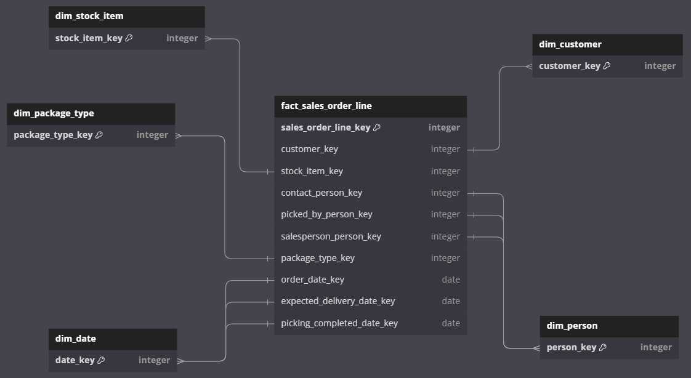
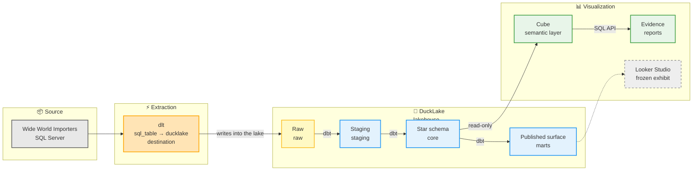
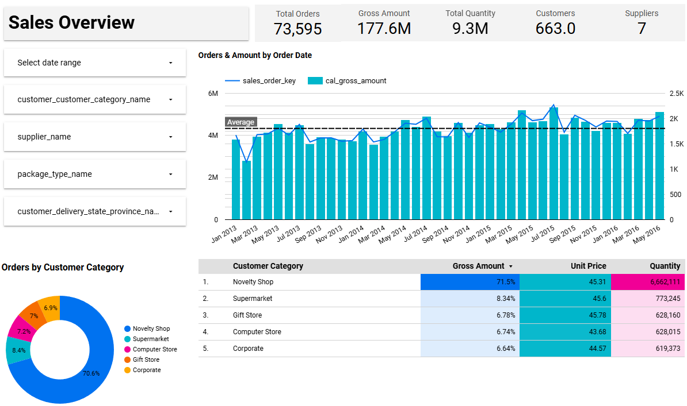

# Wide World Importers Data Warehouse

> Kimball star schema over the Wide World Importers sample OLTP, built on a DuckLake lakehouse.

[](https://www.getdbt.com/) [](https://duckdb.org/) [](https://parquet.apache.org/) [](https://www.postgresql.org/) [](https://www.microsoft.com/sql-server) [](https://www.python.org/)

## Quick start

**This repository ships no data.** The warehouse is built from a live source, so you need a SQL Server holding the [Wide World Importers](https://learn.microsoft.com/en-us/sql/samples/wide-world-importers-what-is) sample database, plus `git`, `make`, [uv](https://docs.astral.sh/uv/) and a container runtime.

```bash
# 1. Credentials. Fill in S3_ACCESS_KEY, S3_SECRET_KEY, CATALOG_USER, CATALOG_PASSWORD
#    and MSSQL_CONNECTION_STRING. Everything else already has a working default.
cp .env.example .env

# 2. Environment and dbt packages, then the object store and the DuckLake catalog.
make install up

# 3. Source → the lake's raw schema, in one dlt run.
make extract

# 4. Build the models and run every test, then print every relation with its shape.
make build
make shape

# 5. The semantic layer and the reports, read-only. Fill in S3_READER_*, CATALOG_READER_*,
#    CUBEJS_* and EVIDENCE_BASIC_*, then `make up` again to load the reader identity.
make up catalog_reader bi_up   # reports at http://127.0.0.1:3000
```

The extraction needs a read-only login on the source; `infrastructure/mssql/prepare_extraction_login.sql` creates one. It grants `db_datareader` and nothing beyond it — no writes, no schema changes, no CDC.

## Overview

| Layer          | Technology                           | Role                                                       |
| -------------- | ------------------------------------ | ---------------------------------------------------------- |
| Source         | SQL Server                           | WWI OLTP, one read-only login                              |
| Extraction     | dlt                                  | declared tables straight to Parquet on the object store    |
| Storage        | S3-compatible object store           | the lake's data files, under `lake/`                   |
| Warehouse      | DuckLake (DuckDB + Postgres catalog) | raw → staging → core → marts                        |
| Transformation | dbt Core                             | dimensional models, enforced contract on the mart          |
| Semantic layer | Cube                                 | every metric defined once, over the star, read in place    |
| Reports        | Evidence Core                        | pages in git that name Cube's measures                     |

**Problem:** analytical queries slow the transactional system; reports need IT. **Solution:** a dimensional warehouse reproducible from one command against the source.



## Architecture

Two stages. The boundary is the point: **the extraction holds the source credential, nothing downstream can reach the source.** Enforced — `make lint` fails if any package outside the source connector acquires the means to connect.


```mermaid
flowchart LR
    subgraph source["📦 Source"]
        OLTP[Wide World Importers<br/>SQL Server]
    end

    subgraph ingest["⚡ Extraction"]
        direction TB
        DLT[dlt<br/>sql_table → ducklake<br/>destination]
    end

    subgraph dwh["🦆 DuckLake<br>lakehouse"]
        direction TB
        RAW[Raw<br/>raw]
        STG[Staging<br/>staging]
        CORE[Star schema<br/>core]
        MART[Published surface<br/>marts]

        STG -->|dbt| CORE
        CORE -->|dbt| MART
    end

    subgraph bi["📊 Visualization"]
        CUBE[Cube<br/>semantic layer]
        EV[Evidence<br/>reports]
        LOOKER[Looker Studio<br/>frozen exhibit]
    end

    OLTP --> DLT
    DLT -->|writes into the lake| RAW
    RAW -->|dbt| STG
    CORE -->|read-only| CUBE
    CUBE -->|SQL API| EV
    MART -.-> LOOKER

    style OLTP fill:#E8E8E8,stroke:#666,stroke-width:2px,color:#333
    style DLT fill:#FFE4B5,stroke:#FFA500,stroke-width:2px,color:#333
    style RAW fill:#FFF9C4,stroke:#FBC02D,stroke-width:2px,color:#333
    style STG fill:#E3F2FD,stroke:#2196F3,stroke-width:2px,color:#333
    style CORE fill:#E3F2FD,stroke:#2196F3,stroke-width:2px,color:#333
    style MART fill:#E3F2FD,stroke:#2196F3,stroke-width:2px,color:#333
    style CUBE fill:#E8F5E9,stroke:#43A047,stroke-width:2px,color:#333
    style EV fill:#E8F5E9,stroke:#43A047,stroke-width:2px,color:#333
    style LOOKER fill:#EEEEEE,stroke:#9E9E9E,stroke-width:2px,stroke-dasharray: 5 5,color:#333
```

One catalog; the layers are schemas inside it.

| Schema           | Holds                                          |
| ---------------- | ---------------------------------------------- |
| `raw/<id>/<table>/` | Parquet on the object store, read in place |
| `staging`     | staging (`stg_`) and intermediate (`int_`) |
| `core`     | dimensions and facts (`dim_`, `fact_`)     |
| `marts`    | denormalized reporting tables (`mart_`)      |

## Filling raw

`make extract` is the only way, and it is one dlt run: every declared table read from the source and loaded into the `raw` schema of the lake, through dlt's DuckLake destination. Nothing is staged locally, nothing is uploaded, and nothing describes what landed except the lake's own catalog.

**Raw is a layer of the warehouse, not a pile of files beside it.** One catalog holds all four — `raw`, `staging`, `core`, `marts` — so `source()` resolves to a relation, the extraction gets schema evolution and time travel for free, and there is no snapshot id in any path.

Every raw row carries dlt's `_dlt_load_id`, the unix timestamp of the load that wrote it. That is what staging turns into `processed_at`, and what makes two builds of one load compare equal.

The contract carries only the tables a model reads: `src/ingestion/tables.yml` and the dbt models move together, and a unit test fails when `__sources.yml` and that file stop naming the same set.

## Commands

```bash
make check      # lint, import boundaries, types, unit tests, build_empty
make build_empty # every dbt model and test on an empty raw schema, no stack
make build      # check raw holds one complete load, then dbt build
make shape      # every relation with its row and column count
make lineage    # column-level lineage as a static page in the dbt target/, no stack
make compare    # build twice, diff every table
make extract    # reload raw from SQL Server
make maintain   # expire snapshots older than KEEP_DAYS (7), delete their files
make raw_schema # regenerate src/ingestion/raw_schema.sql from the loaded lake
make bi_up      # Cube and the reports on top of the stack
make bi_check   # reports reach Cube, and Cube's numbers match the star
make reports_dev # live-reloading pages against the running Cube
make down       # stop the stack, keeping data (clean_storage deletes it)
```

## Project structure

```
├── docs/                    # Project documentation
├── infrastructure/          # Container config, source login SQL
├── reports/                 # Evidence pages; they name measures, never define them
├── semantic/                # Cube config and model: every metric formula and its description
├── src/
│   ├── cli/                 # The `wwi` command
│   ├── config/              # Settings; the only place an env var is named
│   ├── connectors/          # mssql, s3, ducklake
│   ├── ingestion/           # Source → the lake's raw schema
│   ├── warehouse/           # Reading and maintaining the built warehouse
│   └── utils/
├── tests/                   # unit/ needs nothing; integration/ needs the stack
├── wide_world_importers_dw/ # dbt project
└── docker-compose.yml       # Object store + DuckLake catalog; Cube + reports (profile bi)
```

## Documentation

| Document                                       | Covers                                    |
| ---------------------------------------------- | ----------------------------------------- |
| [Roadmap](docs/project_roadmap.md)              | Business context, status, what comes next |
| [Technical Design](docs/technical_design.md)    | Architecture and stack                    |
| [Data Modeling](docs/data_modelling.md)         | Dimensional model                         |
| [Data Catalog](docs/data_warehouse_catalog.md)  | Tables and columns                        |
| [Naming Conventions](docs/naming_convention.md) | Standards, SQL style, Markdown formatting |
| [AGENTS.md](AGENTS.md)                         | Instructions for coding agents: commands, rules, boundaries |

## Sample reports — a frozen exhibit

**These dashboards run against a BigQuery build that is no longer maintained.** The warehouse moved to DuckLake; the BigQuery datasets and the ingestion that fed them are kept as an exhibit, not as something this repository can reproduce.

[View Live Dashboard](https://lookerstudio.google.com/reporting/54a88f82-aeee-494c-b81f-31bb320f299c)


