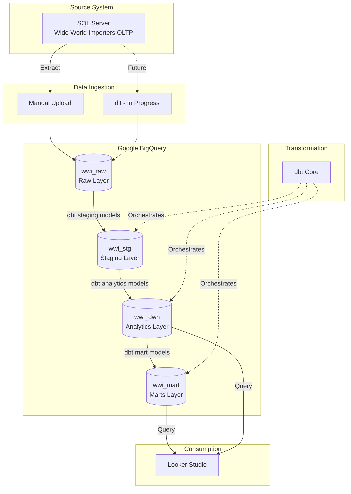

# Technical Design

## Architecture Overview

### Data Flow & Data Lineage

> *Data Flow answers "how does data move?"; Data Lineage answers "where does this table come from?"*

**Data Flow** = **Physical movement** of data through systems and tools

- **Focus**: Infrastructure, tools, orchestration
- **Visualized**: Architecture diagram above

**Data Lineage** = **Logical transformation** of specific datasets

- **Focus**: Table dependencies, column mappings, business logic
- **Examplet**:
  - `sales.Orders` + `sales.OrderLines` → `stg_sales_order` + `stg_sales_order_line` → `fact_sales_order_line`
  - `sales.Customers` → `stg_sales_customer` → `dim_customer`
- **Visualized**: diagram in [Data Modeling](data_modelling.md)
- **Tool**: dbt docs generates interactive lineage graph (DAG)

### Layer Description

> Define the role and materialization strategy of each data layer in BigQuery

| Layer               | Dataset      | Purpose                                                        | Materialization |
| ------------------- | ------------ | -------------------------------------------------------------- | --------------- |
| **Raw**       | `wwi_raw`  | Unmodified source data from SQL Server                         | Tables          |
| **Staging**   | `wwi_stg`  | Cleaned, standardized source data with minimal transformations | Views           |
| **Analytics** | `wwi_dwh`  | Production dimensional models (facts & dimensions)             | Tables          |
| **Marts**     | `wwi_mart` | Denormalized, business-ready datasets for reporting            | Tables          |

### Technology Stack

> Document the tools and technologies used, with rationale for selection

| Component                 | Technology                  | Purpose                                    |
| ------------------------- | --------------------------- | ------------------------------------------ |
| **Source System**   | SQL Server 2019             | OLTP database (Wide World Importers)       |
| **Extraction**      | Manual Upload (dlt in plan) | Data ingestion from SQL Server to BigQuery |
| **Data Warehouse**  | Google BigQuery             | Cloud data warehouse (columnar storage)    |
| **Transformation**  | dbt Core 1.8+               | SQL-based ELT transformations              |
| **Version Control** | Git / GitHub                | Code versioning and collaboration          |
| **Visualization**   | Looker Studio               | Self-service BI dashboards                 |

## Data Model

**Current Scope**: Sales analytics (Sales Order business process)

The data warehouse implements a **star schema** with:

- **Fact**: `fact_sales_order_line` (grain: one row per order line item)
- **Dimensions**: `dim_customer`, `dim_stock_item`, `dim_person`, `dim_package_type`, `dim_date`
- **Role-Playing Dimensions**: Person dimension reused for salesperson, contact person, and picker roles

**Extensibility**: Architecture supports additional fact tables for other business processes. Additional dimensions may be introduced as new business processes are added.

See [Data Modeling](data_modelling.md) for detailed design.

## Key Design Decisions

### 1. ELT over ETL

Data is loaded raw into BigQuery, then transformed using dbt. This leverages BigQuery's processing power and enables version-controlled transformations.

### 2. dbt Transformation Layers

- **Staging**: 1:1 mapping with source tables, light cleansing only
- **Analytics**: Business logic, joins, surrogate key generation
- **Marts**: Pre-joined denormalized datasets for BI tools

### 3. Surrogate Keys

Natural keys from source are preserved; surrogate keys not implemented (BigQuery handles large key spaces efficiently).

## Data Quality

>   Outline data quality approach and validation mechanisms

- **dbt tests**: Uniqueness, not-null, referential integrity enforced via `schema.yml`
- **Source freshness**: Monitored through dbt's `freshness` checks (when configured)
- **Naming standards**: Enforced via conventions documented in [Naming Convention](naming_convention.md)
