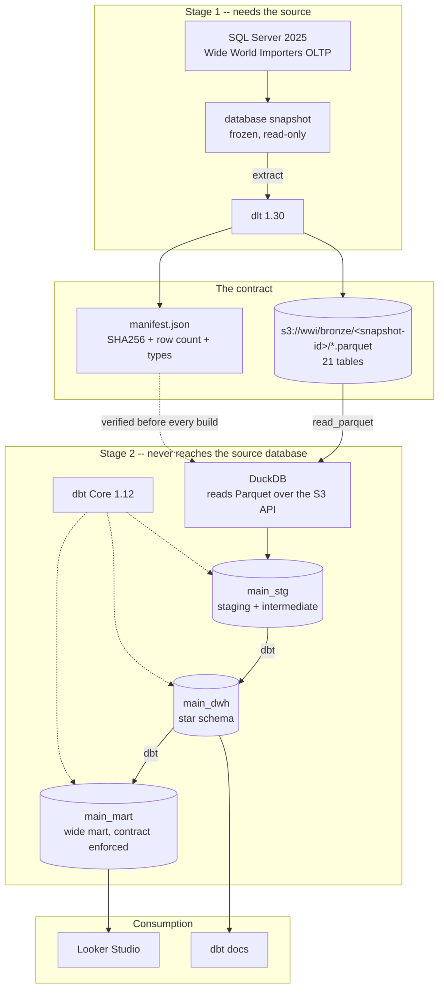

# Technical Design

## Architecture

Two stages sharing nothing but an artifact. Stage 1 holds the source credential and produces an
immutable, checksummed Parquet snapshot. Stage 2 consumes it and never opens a connection to SQL
Server. The boundary is enforced by import contracts, not convention — see [Boundaries](#boundaries).

```mermaid
graph TB
    subgraph Stage1["Stage 1 -- needs the source"]
        OLTP[SQL Server 2025<br/>Wide World Importers OLTP]
        SNAP[database snapshot<br/>frozen, read-only]
        DLT[dlt 1.30]
    end

    subgraph Boundary["The contract"]
        PARQUET[(s3://wwi/bronze/&lt;snapshot-id&gt;/*.parquet<br/>21 tables)]
        MANIFEST[manifest.json<br/>SHA256 + row count + types]
    end

    subgraph Stage2["Stage 2 -- never reaches the source database"]
        DUCK[DuckDB<br/>reads Parquet over the S3 API]
        STG[(main_stg<br/>staging + intermediate)]
        DWH[(main_dwh<br/>star schema)]
        MART[(main_mart<br/>wide mart, contract enforced)]
        DBT[dbt Core 1.12]
    end

    subgraph Consume["Consumption"]
        BI[Looker Studio]
        DOCS[dbt docs]
    end

    OLTP --> SNAP
    SNAP -->|extract| DLT
    DLT --> PARQUET
    DLT --> MANIFEST
    PARQUET -->|read_parquet| DUCK
    MANIFEST -.->|verified before every build| DUCK
    DUCK --> STG
    STG -->|dbt| DWH
    DWH -->|dbt| MART
    DBT -.-> STG
    DBT -.-> DWH
    DBT -.-> MART
    MART --> BI
    DWH --> DOCS
```

The earlier BigQuery build (`wwi_raw` → `wwi_stg` → `wwi_dwh` → `wwi_mart`, fed by manual CSV
upload) is frozen as an exhibit. The Looker Studio dashboard still points at it.

## Layers

| Layer | Schema | Purpose | Materialisation |
|---|---|---|---|
| Raw | — | Parquet under `s3://$S3_BUCKET/bronze/<snapshot-id>/`, read in place | none |
| Staging | `main_stg` | One view per source table: renames and casts, no joins | Views |
| Intermediate | `main_stg` | Joins reused by more than one downstream model | Views |
| Analytics | `main_dwh` | The star schema: dimensions and the fact | Tables |
| Marts | `main_mart` | One denormalised table for BI, columns under contract | Tables |

**Raw is not a layer with tables in it.** `sources.yml` points `source()` straight at the Parquet
via `read_parquet` — no load step, nothing copied. That is the one place this differs from the
frozen BigQuery layout, where `wwi_raw` held real tables.

*Data flow* is physical movement (the diagram above). *Data lineage* is logical dependency between
tables — see [Data Modeling](data_modelling.md), or `dbt docs` for the interactive DAG.

## Stack

| Component | Technology | Purpose |
|---|---|---|
| Source | SQL Server 2025 | WWI OLTP, read from a frozen database snapshot |
| Extraction | dlt 1.30 → Parquet | 21 tables, checksummed into `data/snapshots/manifest.json` |
| Object store | SeaweedFS (S3 API) | The bronze snapshot and the lake's Parquet |
| Warehouse | DuckLake on DuckDB | Parquet on the store, catalog in Postgres 16 |
| Transformation | dbt Core 1.12 + dbt-duckdb 1.11 | SQL-based ELT |
| Tooling | Python 3.12, `wwi` CLI | Extraction, publication, verification, demo |
| Visualization | Looker Studio | Frozen against the BigQuery warehouse |

The `dev` (BigQuery) profile target is kept as an exhibit. `dbt-bigquery` is **not** installed: it
pulled 45 packages into the lock file for a target nothing builds against.

**The object store is a replaceable detail, and that was tested rather than assumed.** The stack was
brought up against a second S3-compatible implementation (RustFS) with one compose override changing
only the image — same credentials, bucket, profile and models — and all relations came out with
identical row counts. The override is not kept: it was evidence, not something that runs.

**`-volume.max=10` is a real ceiling.** At `volumeSizeLimitMB=1024` that is 10 GiB, and every build
writes a full copy of each table into the lake. There is no retention command — one was written,
never needed on a store holding a single snapshot, and deleted. A full store is reset with
`make clean_storage` and rebuilt.

## Boundaries

The extraction half holds the source credential; nothing downstream may reach the source. Three
`import-linter` contracts fail `make lint` when that breaks:

| Contract | Prevents |
|---|---|
| Only `connectors.mssql` may import `dlt` / `sqlalchemy` / `pymssql` | a new source connection anywhere else |
| `warehouse`, `demo`, `contracts`, `config`, `utils` must not import `connectors.mssql` | the transform half acquiring the means to connect |
| Layered: `utils`/`config` → `contracts` → `connectors` → `ingestion`/`warehouse` → `demo`/`cli` | the core reaching back up; a new module escaping the layering |

Each was shown to fail before it was trusted.

## Data model

**Scope**: Sales Order business process.

- **Fact**: `fact_sales_order_line`, grain one row per order line
- **Dimensions**: `dim_customer`, `dim_stock_item`, `dim_person`, `dim_package_type`, `dim_date`
- **Person roles**: salesperson, picker and contact all resolve to `dim_person`; the mart publishes
  each role's columns under its own prefix

See [Data Modeling](data_modelling.md).

## Key decisions

**1. ELT over ETL.** Extraction lands Parquet and transforms nothing; dbt does it all in SQL, in
version control. Nothing is loaded — DuckDB reads the Parquet where it sits.

**2. Four transformation layers, no pass-through.** Staging is exactly one view per source table,
renames and casts only, no joins — verified across all 15. Intermediate holds joins reused more than
once; there is one, `int_city_flattened`. Analytics is the star. Marts are denormalised for BI under
an enforced contract. Five `stg_*_wwi` models whose only job was to be selected from by an
identically-shaped `analytics/` model are gone, along with the models that selected them.

**3. One surrogate key.** `dim_stock_item.stock_item_sk`, MD5 over the natural key; every other
dimension is keyed on its natural key. Its original justification — versioning `unit_price` — was
**falsified by measurement**: no stock item has ever had more than one distinct price, and the data
generator never writes to that table, so extending the data cannot create history either. Kept
because it costs nothing and a later Type 2 build would want it.

## Data quality

| Guard | What it covers |
|---|---|
| 44 dbt tests | `unique` + `not_null` on every dimension key, ten `relationships` from the fact, manifest row-count parity across all 15 staging models, a mart grain test, a `dim_date` calendar test |
| Enforced contract | `mart_sales_order_line` declares all 70 columns and types; an upstream change to its shape fails the build |
| Determinism | `make compare` builds twice and diffs every relation, naming the column when one differs. 0 differing |
| Snapshot integrity | `make verify` checks Parquet against the SHA256, row counts and column types in the manifest |
| Static gates | `make check` — ruff, import contracts, mypy, unit tests, `sources.yml` drift |

Source freshness is not configured and cannot be: the source is a frozen snapshot, so freshness has
nothing to measure.

Naming and SQL style: [Naming Convention](naming_convention.md).
