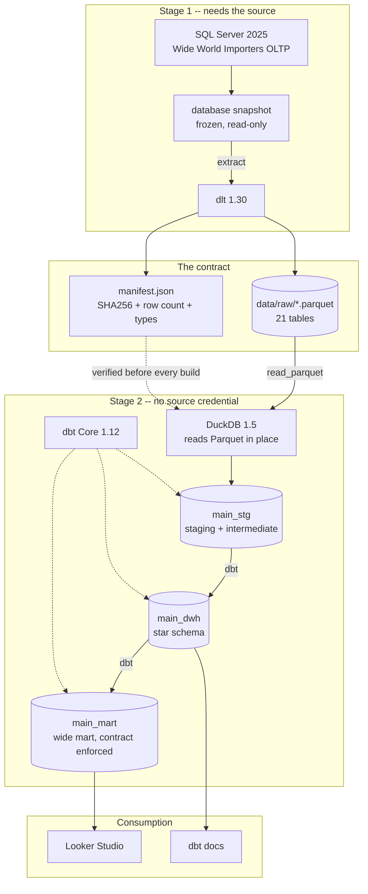

# Technical Design

## Architecture Overview

Two stages that share nothing but an artifact. Stage 1 holds the source credential and produces
an immutable, checksummed Parquet snapshot. Stage 2 consumes it and never opens a connection to
SQL Server.

```mermaid
graph TB
    subgraph Stage1["Stage 1 -- needs the source"]
        OLTP[SQL Server 2025<br/>Wide World Importers OLTP]
        SNAP[database snapshot<br/>frozen, read-only]
        DLT[dlt 1.30]
    end

    subgraph Boundary["The contract"]
        PARQUET[(data/raw/*.parquet<br/>21 tables)]
        MANIFEST[manifest.json<br/>SHA256 + row count + types]
    end

    subgraph Stage2["Stage 2 -- no source credential"]
        DUCK[DuckDB 1.5<br/>reads Parquet in place]
        STG[(main_stg<br/>staging + intermediate)]
        DWH[(main_dwh<br/>star schema)]
        MART[(main_mart<br/>wide mart, contract enforced)]
        DBT[dbt Core 1.12]
    end

    subgraph Consume["Consumption"]
        BI[Looker Studio]
        DOCS[dbt docs]
    end

    OLTP --> SNAP
    SNAP -->|extract| DLT
    DLT --> PARQUET
    DLT --> MANIFEST
    PARQUET -->|read_parquet| DUCK
    MANIFEST -.->|verified before every build| DUCK
    DUCK --> STG
    STG -->|dbt| DWH
    DWH -->|dbt| MART
    DBT -.-> STG
    DBT -.-> DWH
    DBT -.-> MART
    MART --> BI
    DWH --> DOCS
```

The earlier architecture — manual CSV upload into BigQuery datasets `wwi_raw` → `wwi_stg` →
`wwi_dwh` → `wwi_mart`, with Looker Studio on top — is frozen as an exhibit. The Looker Studio
dashboard still points at it.

### Data Flow & Data Lineage

> *Data Flow answers "how does data move?"; Data Lineage answers "where does this table come from?"*

**Data Flow** = **Physical movement** of data through systems and tools

- **Focus**: Infrastructure, tools, orchestration
- **Visualized**: Architecture diagram above

**Data Lineage** = **Logical transformation** of specific datasets

- **Focus**: Table dependencies, column mappings, business logic
- **Examplet**:
  - `sales.Orders` + `sales.OrderLines` → `stg_sales_order` + `stg_sales_order_line` → `fact_sales_order_line`
  - `sales.Customers` → `stg_sales_customer` → `dim_customer`
- **Visualized**: diagram in [Data Modeling](data_modelling.md)
- **Tool**: dbt docs generates interactive lineage graph (DAG)

### Layer Description

> The role and materialisation of each layer, as built.

| Layer            | Schema      | Purpose                                                    | Materialisation |
| ---------------- | ----------- | ---------------------------------------------------------- | --------------- |
| **Raw**          | —           | Parquet under `data/raw/`, read in place                    | none            |
| **Staging**      | `main_stg`  | One view per source table: renames and casts, no joins      | Views           |
| **Intermediate** | `main_stg`  | Joins reused by more than one downstream model              | Views           |
| **Analytics**    | `main_dwh`  | The star schema: dimensions, role-playing views, the fact   | Tables, and views for the three role-playing dimensions |
| **Marts**        | `main_mart` | One denormalised table for BI, column list under contract   | Tables          |

**Raw is not a layer with tables in it.** `sources.yml` points `source()` straight at the Parquet
via `read_parquet`, so there is no load step and nothing is copied. That is the one place this
differs from the frozen BigQuery layout, where `wwi_raw` held real tables.

The BigQuery datasets `wwi_raw` / `wwi_stg` / `wwi_dwh` / `wwi_mart` are frozen as an exhibit.

### Technology Stack

> Document the tools and technologies used, with rationale for selection

| Component           | Technology                    | Purpose                                                        |
| ------------------- | ----------------------------- | -------------------------------------------------------------- |
| **Source System**   | SQL Server 2025               | OLTP database (Wide World Importers), read from a frozen snapshot |
| **Extraction**      | dlt 1.30 → Parquet            | 21 tables, checksummed into `data/snapshots/manifest.json`      |
| **Data Warehouse**  | DuckDB 1.5                    | Single-file columnar engine, reads the Parquet in place         |
| **Transformation**  | dbt Core 1.12 + dbt-duckdb 1.11 | SQL-based ELT transformations                                 |
| **Version Control** | Git / GitHub                  | Code versioning and collaboration                              |
| **Visualization**   | Looker Studio                 | Self-service BI dashboards (frozen against the BigQuery warehouse) |

`dbt-bigquery` is still installed. It is kept so the frozen BigQuery models still compile as an exhibit,
not because anything builds against BigQuery.

## Data Model

**Current Scope**: Sales analytics (Sales Order business process)

The data warehouse implements a **star schema** with:

- **Fact**: `fact_sales_order_line` (grain: one row per order line item)
- **Dimensions**: `dim_customer`, `dim_stock_item`, `dim_person`, `dim_package_type`, `dim_date`
- **Role-Playing Dimensions**: Person dimension reused for salesperson, contact person, and picker roles

**Extensibility**: Architecture supports additional fact tables for other business processes. Additional dimensions may be introduced as new business processes are added.

See [Data Modeling](data_modelling.md) for detailed design.

## Key Design Decisions

### 1. ELT over ETL

Extraction lands Parquet and does no transformation; dbt does all of it in SQL, in version
control. Nothing is loaded into the warehouse — DuckDB reads the Parquet where it sits.

### 2. dbt Transformation Layers

- **Staging**: exactly one view per source table. Renames and casts only, **no joins** — verified
  across all 15.
- **Intermediate**: joins reused by more than one downstream model. One today,
  `int_city_flattened`, because `dim_customer` needs city-with-country twice.
- **Analytics**: the star schema. Dimensions and the fact carry their own joins and materialise
  as tables.
- **Marts**: pre-joined and denormalised for BI, with the column list under an enforced contract.

There is no separate pass-through layer between staging and the star. There used to be five
`stg_*_wwi` models whose only job was to be selected from by an identically-shaped `analytics/`
model; both halves are gone.

### 3. Surrogate Keys

One surrogate key exists: `dim_stock_item.stock_item_sk`, an MD5 over the natural key. Every other
dimension is keyed on its natural key.

The key is there so a later Type 2 build can give one stock item several rows. Its original
justification — versioning `unit_price` — was **falsified by measurement**: no stock item in the
source has ever had more than one distinct price, and the data generator never writes to that table
at all, so extending the data cannot create history either. It is kept because it costs nothing and
nothing depends on it.

## Data Quality

- **dbt tests**: 50 tests in the build. `unique` + `not_null` on every dimension key, ten
  `relationships` tests from the fact, a manifest row-count parity test across all 15 staging
  models, a grain test on the mart, and a calendar test pinning `dim_date`.
- **Contract**: `mart_sales_order_line` declares all 70 columns and their types with
  `contract: enforced`. An upstream column that would change the mart's shape fails the build.
- **Determinism**: `make compare` builds twice into two databases and diffs every relation,
  naming the column when one differs. 26 relations, 0 differing.
- **Snapshot integrity**: `make verify` checks the Parquet against the SHA256 and row counts in
  `data/snapshots/manifest.json`. Row counts are the cheap half; the checksum catches the rest.
- **Naming standards**: [Naming Convention](naming_convention.md).

Source freshness is not configured, and cannot be: the source is a frozen snapshot, so freshness
has nothing to measure.
