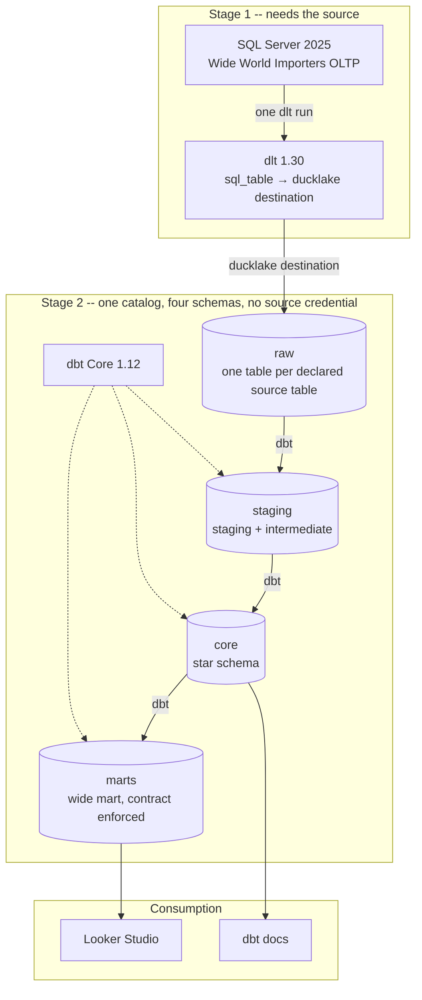

# Technical Design

## Architecture

Two stages sharing one lakehouse. Stage 1 holds the source credential and loads the declared tables into the lake's `raw` schema. Stage 2 builds every other schema from it and never opens a connection to SQL Server. The boundary is enforced by import contracts, not convention — see [Boundaries](#boundaries).

```mermaid
graph TB
    subgraph Stage1["Stage 1 -- needs the source"]
        OLTP[SQL Server 2025<br/>Wide World Importers OLTP]
        DLT[dlt 1.30<br/>sql_table → ducklake destination]
    end

    subgraph Lake["Stage 2 -- one catalog, four schemas, no source credential"]
        BRONZE[(raw<br/>one table per declared source table)]
        STG[(staging<br/>staging + intermediate)]
        DWH[(core<br/>star schema)]
        MART[(marts<br/>wide mart, contract enforced)]
        DBT[dbt Core 1.12]
    end

    subgraph Consume["Consumption"]
        BI[Looker Studio]
        DOCS[dbt docs]
    end

    OLTP -->|one dlt run| DLT
    DLT -->|ducklake destination| BRONZE
    BRONZE -->|dbt| STG
    STG -->|dbt| DWH
    DWH -->|dbt| MART
    DBT -.-> STG
    DBT -.-> DWH
    DBT -.-> MART
    MART --> BI
    DWH --> DOCS
```

**One catalog, four schemas.** `raw` is written by dlt; `staging`, `core` and `marts` are built by dbt. They share a Postgres catalog and a data path, so a layer is a schema rather than a storage convention, and `source()` resolves to a relation. Nothing freezes the source first, and no dbt snapshot exists — DuckLake's own `snapshot_id` is a lake version, used by `make compare` for time travel.

The earlier BigQuery build (`wwi_raw` → `wwi_stg` → `wwi_dwh` → `wwi_mart`, fed by manual CSV upload) is frozen as an exhibit. The Looker Studio dashboard still points at it.

## Layers

| Layer        | Schema    | Purpose                                                    | Materialisation |
| ------------ | --------- | ---------------------------------------------------------- | --------------- |
| Raw          | `raw`     | One table per entry in `tables.yml`, loaded by dlt          | Tables          |
| Staging      | `staging` | One view per source table: renames only, no joins, no casts | Views           |
| Intermediate | `staging` | Joins reused by more than one downstream model              | Views           |
| Core         | `core`    | The star schema: conformed dimensions and the fact          | Tables          |
| Marts        | `marts`   | One denormalised table for BI, columns under contract       | Tables          |

Raw holds the source as it arrived — renamed and typed by dlt, nothing else — plus `_dlt_load_id` on every row, the unix timestamp of the load that wrote it. Staging turns that into `processed_at`, which is why two builds of one load compare equal.

DuckLake decides how a raw table is stored. A large one becomes Parquet under the data path; a small one may be inlined into the catalog instead. Neither is addressed by hand: `sources.yml` names a database and a schema, and the catalog does the rest.

*Data flow* is physical movement (the diagram above). *Data lineage* is logical dependency between tables — see [Data Modeling](data_modelling.md), or `dbt docs` for the interactive DAG.

## Stack

| Component      | Technology                      | Purpose                                                     |
| -------------- | ------------------------------- | ----------------------------------------------------------- |
| Source         | SQL Server 2025                 | WWI OLTP, read in place by a read-only login                |
| Extraction     | dlt 1.30, ducklake destination  | The declared tables, loaded into the lake's`raw` schema |
| Object store   | SeaweedFS (S3 API)              | The lake's data files                                       |
| Warehouse      | DuckLake on DuckDB              | Parquet on the store, catalog in Postgres 16                |
| Transformation | dbt Core 1.12 + dbt-duckdb 1.11 | SQL-based ELT                                               |
| Tooling        | Python 3.12,`wwi` CLI         | Extraction, verification, inspection                        |
| Visualization  | Looker Studio                   | Frozen against the BigQuery warehouse                       |

`profiles.yml`, at the repository root and the one `make` points dbt at, declares one target, `lake`. The BigQuery build is history, not a target this repository can run — `dbt-bigquery` is deliberately not installed.

**The catalog password is never in a connection string.** libpq reads it from `PGPASSWORD`, which `make` sets from `CATALOG_PASSWORD`, for the `wwi` commands, dlt and dbt alike. A connection string lands in DuckDB's error messages, which all three print and dbt also logs; out of the string, the password is never echoed and needs no quoting. Running any of them outside `make` means exporting `PGPASSWORD` yourself.

**The object store is a replaceable detail, and that was tested rather than assumed.** The stack was brought up against a second S3-compatible implementation (RustFS) with one compose override changing only the image — same credentials, bucket, profile and models — and all relations came out with identical row counts. The override is not kept: it was evidence, not something that runs.

**`-volume.max=10` is a real ceiling, and one bucket reaches it at about 7 GiB.** SeaweedFS gives each bucket its own collection and grows a collection seven volumes at a time, so the `wwi` bucket holds 7 of the 10 one-GiB volumes and a second bucket could not be written to at all. Every build writes a full copy of each table into the lake. There is no retention command — one was written, never needed at this size, and deleted. A full store is reset with `make clean_storage` and rebuilt.

## Boundaries

The extraction half holds the source credential; nothing downstream may reach the source. Three `import-linter` contracts fail `make lint` when that breaks:

| Contract                                                                                                           | Prevents                                                      |
| ------------------------------------------------------------------------------------------------------------------ | ------------------------------------------------------------- |
| Only`connectors.mssql` may import `dlt` / `sqlalchemy` / `pymssql`                                         | a new source connection anywhere else                         |
| `warehouse`, `contracts`, `config`, `utils` must not import `connectors.mssql`                             | the transform half acquiring the means to connect             |
| Layered:`utils`/`config` → `contracts` → `connectors` → `ingestion`/`warehouse` → `cli`         | the core reaching back up; a new module escaping the layering |

Each was shown to fail before it was trusted.

## Data model

**Scope**: Sales Order business process.

- **Fact**: `fct_sales_order_line`, grain one row per order line
- **Dimensions**: `dim_customer`, `dim_stock_item`, `dim_person`, `dim_package_type`, `dim_date`
- **Person roles**: salesperson, picker and contact all resolve to `dim_person`; the mart publishes each role's columns under its own prefix

See [Data Modeling](data_modelling.md).

## Key decisions

**1. ELT over ETL.** Extraction lands the source as it is and transforms nothing; dbt does it all in SQL, in version control.

**1b. Plain EL, per-table, with no cross-table transaction.** An earlier build read every table inside one SQL Server snapshot-isolation transaction and asserted the transaction id had not changed, so the snapshot was provably one instant. It was removed. The guarantee is real and the technique is the right one on a live 24/7 OLTP — but this source is a static sample database, and the extraction separately asserts the data generator is off, so the protection had no threat to protect against. What it cost was concrete: it forced one `pipeline.extract()` call per resource, a local staging directory and a hand-written flattening step, none of which dlt needs. The trade is stated rather than hidden: the referential tests still pass, but now because the source does not move, not because the pipeline guarantees it. On a source that does move, put it back.

**2. Four transformation layers, no pass-through.** Staging is exactly one view per source table, renames and casts only, no joins. Intermediate holds joins reused more than once; there is one, `int_cities__joined`. Analytics is the star. Marts are denormalised for BI under an enforced contract. Five `stg_*_wwi` models whose only job was to be selected from by an identically-shaped `analytics/` model are gone, along with the models that selected them.

**3. One surrogate key.** `dim_stock_item.stock_item_sk`, MD5 over the natural key; every other dimension is keyed on its natural key. Its original justification — versioning `unit_price` — was **falsified by measurement**: no stock item has ever had more than one distinct price, and the data generator never writes to that table, so extending the data cannot create history either. Kept because it costs nothing and a later Type 2 build would want it.

**4. The extraction contract carries only what a model reads.** `tables.yml` and the dbt models move together: a table enters the contract in the same change as the model that selects from it, and a unit test fails when `tables.yml` and `sources.yml` stop naming the same set. Six tables were once carried for a supply-chain fact that does not exist; they were removed. Adding them back is a YAML edit in the pull request that needs them.

**5. Raw in the lake, not beside it.** An earlier build wrote raw as bare Parquet under a per-run prefix and described it with a hand-written, committed `manifest.json` carrying a SHA256, a row count and the column types of every file. That bought integrity checking the object store and the catalog now provide, and it cost: a run id in every path, a `SNAPSHOT_ID` variable, a generated `sources.yml` that had to be regenerated and committed after each extraction, and two dbt objects that read a JSON file off local disk. dlt's DuckLake destination writes into the same catalog dbt builds in, so all of that is the table format's job. The trade is stated rather than hidden: per-file checksums are gone, which is normal inside one system and would not be across an organisational boundary.

## Data quality

| Guard              | What it covers                                                                                                                                                                                 |
| ------------------ | ---------------------------------------------------------------------------------------------------------------------------------------------------------------------------------------------- |
| dbt tests          | `unique` + `not_null` on every dimension key, a `relationships` test on every foreign key from the fact, a raw row-count parity test on every staging model, a mart grain test, a `dim_date` calendar test |
| Enforced contract  | `obt_sales_order_line` declares every column and type; an upstream change to its shape fails the build                                                                                   |
| Determinism        | `make compare` builds twice and diffs every relation, naming the column when one differs. 0 differing                                                                                        |
| Load integrity     | `make extract` counts the source before the load and the lake after it, and refuses a difference — row-level security filters silently, and usually only part of a table |
| Static gates       | `make check` — ruff, import contracts, mypy, unit tests including `sources.yml` against `tables.yml` — plus `dbt parse`, which compiles every model without a database. That is all CI runs: the warehouse is built from a source CI cannot reach, so the tests above run on a developer machine |

Source freshness is not configured. Raw is a relation now, so `loaded_at_field` would work — but a threshold on a manually triggered load against a static sample database would be a number invented to have one.

Naming and SQL style: [Naming Convention](naming_convention.md).
